## Krótko o mnie
Jestem programistą Java z doświadczeniem komercyjnym w tworzeniu i rozwijaniu aplikacji webowych. 
Specjalizuję się głównie w backendzie opartym o Spring Framework, ale pracuję również fullstackowo,
wykorzystując Angular (oraz inne technologie frontendowe), a także w dużym stopniu ostatnio Python.

Posiadam 2 lata doświadczenia komercyjnego jako Software Developer w branży finansowej oraz obecnie realizuję projekty w modelu freelance,
obejmujące rozwój, utrzymanie i wdrażanie aplikacji webowych.

Na co dzień pracuję z Java, Spring Boot, Python, SQL, Dockerem oraz technologiami frontendowymi. 
Dodatkowo rozwijam własne projekty, w których eksperymentuję z&nbsp;Pythonem, AI oraz automatyzacją przetwarzania danych i obrazów.

Posiadam certyfikat [Oracle Certified Professional: Java SE 17 Developer](https://catalog-education.oracle.com/ords/certview/sharebadge?id=06D8FB131C5DD242ECD4DD0E1CDE8298A2D4811C304334AC13A5D125F60D1079#)

Mam wykształcenie Techniczno-Informatyczne (mgr inż.) oraz Studia podyplomowe w&nbsp;zakresie Programowania w języku Java [`więcej`](#wicej-o-mnie)

## Technologie, w których pracuję

- Java;
- Kotlin;
- JavaScript / TypeScript;
- Python;
- HTML, CSS;
- SQL;

#### Frameworki, interfejsy i standardy:	

- Spring Framework;
- JakartaEE;
- REST;
- JDBC, JPA, Hibernate, CRUD;
- Angular, AngularJS, React;
- Django, FastAPI;
- MySQL, PostgreSQL, MongoDB;
- JUnit, Spock, Mockito, Liquibase;
- Docker, Git, GitHub, GitLab, Dokploy, Jenkins;
- Grafana, Prometheus, ELK;

## Umiejętności

* Znajomość języka Java oraz Kotlin na poziomie średniozaawansowanym oraz doświadczenie w rozwijaniu aplikacji w tych językach;
* Umiejętność pracy z HTML, CSS, JavaScript a także z frameworkami Angular i&nbsp;AngularJS oraz komercyjne doświadczenie w rozwijaniu serwisów 
z&nbsp;wykorzystaniem Angular;
* Znajomość Python oraz doświadczenie w tworzeniu, rozwijaniu i utrzymaniu aplikacji w tym języku, głównie w ramach działalności 'freelance';
* Wiedza i doświadczenie z zakresu obsługi relacyjnych baz danych i SQL, a&nbsp;także z&nbsp;bazami nierelacyjnymi, jak MongoDB;
* Znajomość narzędzi kontroli wersji oraz ciągłej integracji (CI/CD) (GIT, Jenkins, Docker, Dokploy);
* Doświadczenie i umiejętność współpracy w zespole programistów z użyciem systemów kontroli wersji;
* Praktyczne doświadczenie pracy w metodykach Agile (Jira, Confluence).

## Umiejętności w praktyce

* Projektowanie REST API
* Spring Boot / Spring Security
* Relacyjne i nierelacyjne bazy danych
* Testy jednostkowe i integracyjne
* Docker i deployment VPS
* Integracje z zewnętrznymi API
* CI/CD
* Authentication & Authorization
* Fullstack development

* * *

# Moje Projekty
 

## Quiz-Master

Rozwijana platforma edukacyjna umożliwiająca tworzenie oraz rozwiązywanie quizów tematycznych. Projekt został zaprojektowany jako skalowalne rozwiązanie fullstackowe z backendową walidacją odpowiedzi, rejestrowaniem wyników oraz możliwością dalszej rozbudowy.

#### Technologie

* Część 'backendowa' aplikacji napisana w języku **Java** z wykorzystaniem frameworka **Spring**;
* 'Frontend' utworzony przy pomocy frameworka **Angular**, z wykorzystaniem Bootstrap;
* Korzysta z nierelacyjnej bazy danych **MongoDB** i narzędzia **Liquibase** do migracji;
* Pisząc testy korzystano (poza **Java**) z jezyka **Groovy** oraz z biblioteki **Spock** oraz **RestAssured**;

  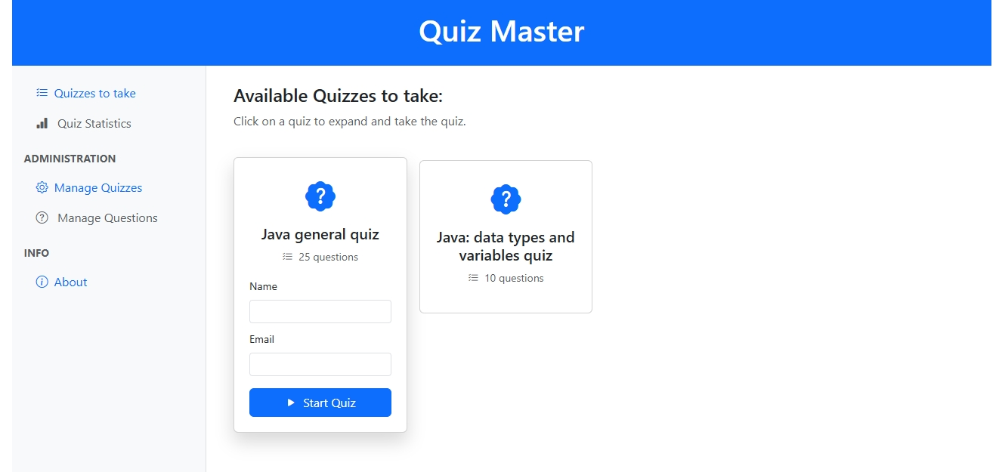

#### Funkcjonalności

* wykonywanie quizów bez konieczności logowania;
* rejestracja czasu oraz wyników;
* backendowa walidacja odpowiedzi;
* dynamiczne mieszanie pytań i odpowiedzi;
* zarządzanie quizami oraz pytaniami;
* generowanie podsumowań wyników.

  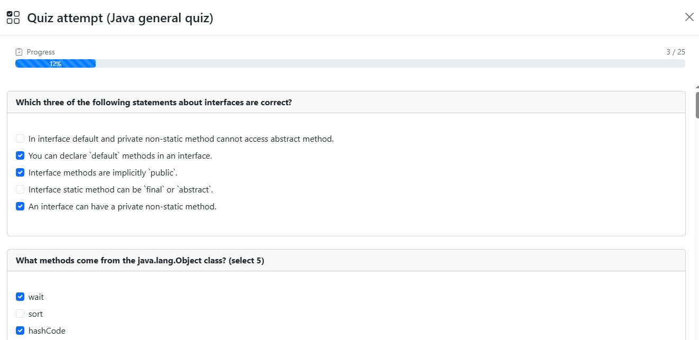

#### Planowany rozwój

* konta użytkowników;
* statystyki i historia wyników;
* komentarze do pytań;
* rozbudowany panel administracyjny.

  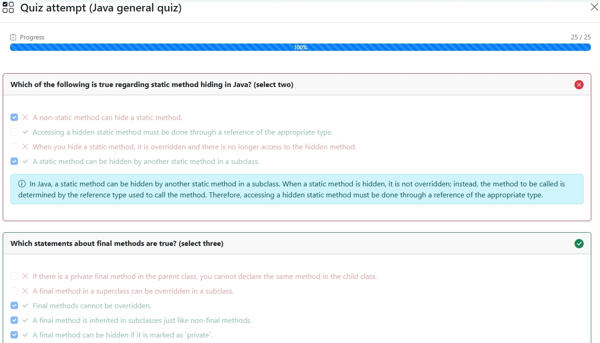
  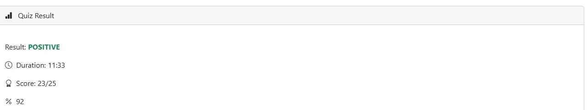

#### Linki

* [Działająca aplikacja](https://quizmaster.tigerstel.xyz)
* [Kod projektu](https://github.com/TomaszGerstel/QuizMaster.git)

* * *

## J-Countant

Aplikacja wspierająca zarządzanie finansami w małej działalności gospodarczej. System umożliwia ewidencję dokumentów, analizę transakcji oraz automatyczne wyliczanie podatków i bilansów finansowych.

Projekt oparty o architekturę REST z oddzielnym frontendem i backendem.

  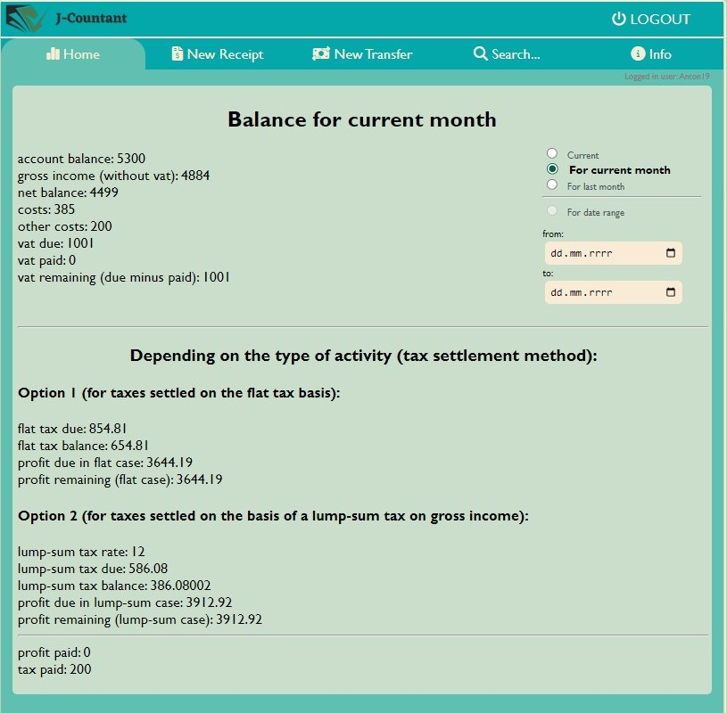

#### Technologie

* Część 'backendowa' aplikacji napisana w języku **Java** z wykorzystaniem frameworku **Spring**;
* Korzysta z relacyjnej bazy danych **PostgreSQL**;
* Wykorzystane komponenty Spring: **Spring Security**, **Spring Web**, **Spring Data**;
* Pozostałe technologie to: **JPA**, **Hibernate**, **Liquibase**, **Hibernate Validator**;
* Narzędzia wykorzystane w testowaniu aplikacji: **JUnit**, **Mockito**, **AssertJ**, **Testcontainers**;
* Technologie, których użyto do wdrażania aplikacji: **Git**, **Docker**, **Docker Compose**, **AWS**;
* Część 'front-endowa' zrealizowana przy pomocy frameworku **AngularJS**

#### Funkcjonalności

* logowanie i rejestracja użytkowników;
* zarządzanie fakturami i transakcjami;
* wyliczanie podatków i bilansu;
* analiza finansowa dla zakresów dat;
* generowanie raportów finansowych.

  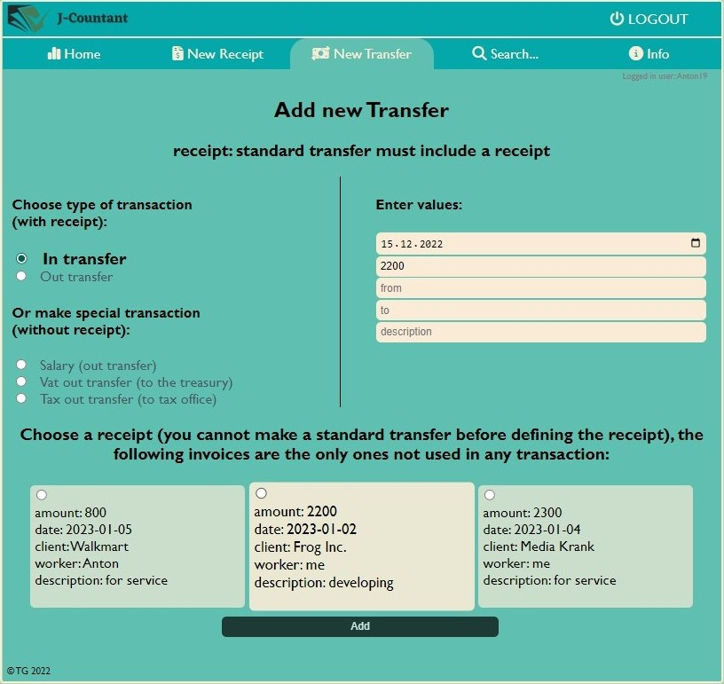

#### Linki

* [Działająca aplikacja](http://jcountant.s3-website.eu-west-3.amazonaws.com)
* [Kod projektu - front](https://github.com/TomaszGerstel/JCountant_front.git)
* [Kod projektu - back](https://github.com/TomaszGerstel/JCountant.git)

* * *

## AI Image Processing Platform

Platforma do wsadowego przetwarzania obrazów z wykorzystaniem AI, stworzona do automatyzacji obróbki zdjęć produktowych, katalogowych oraz marketplace’owych.

Aplikacja umożliwia jednoczesne przetwarzanie wielu obrazów poprzez operacje takie jak resize, konwersja formatów, usuwanie tła, AI upscaling oraz poprawę jakości.

  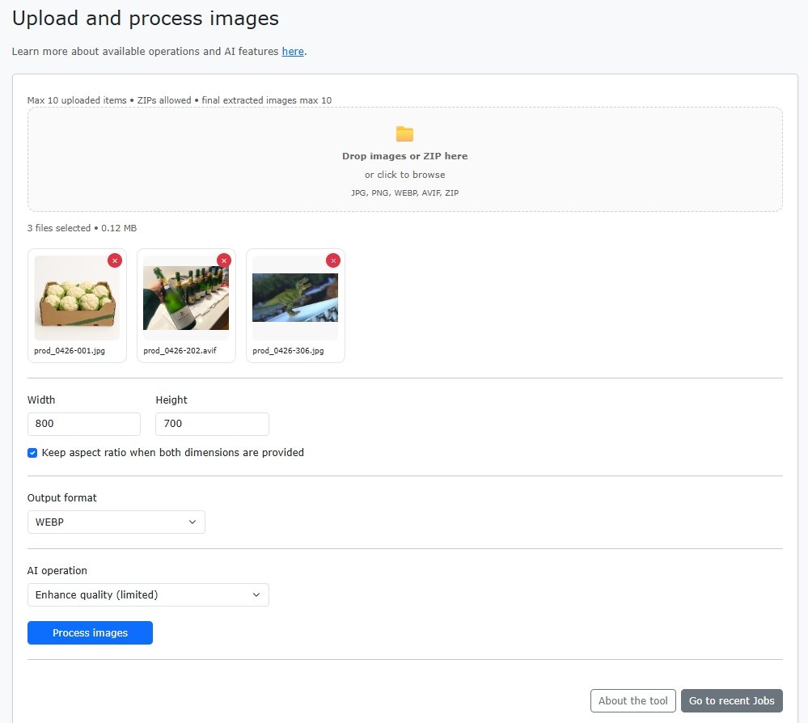

#### Technologie

* Python
* FastAPI
* Pillow
* OpenCV

  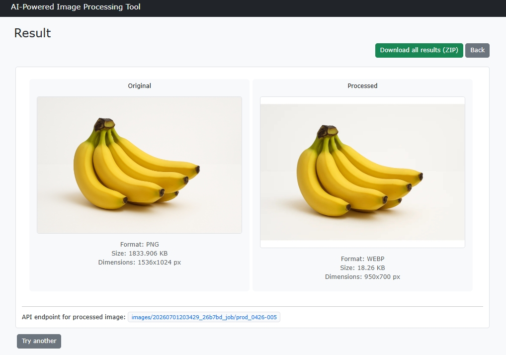

#### Funkcjonalności

* upload pojedynczych plików i ZIP;
* batch image processing;
* resize z zachowaniem proporcji;
* konwersja JPEG / PNG / WEBP / AVIF;
* lokalne usuwanie tła;
* zaawansowane AI background removal;
* AI upscaling;
* quality enhancement.

  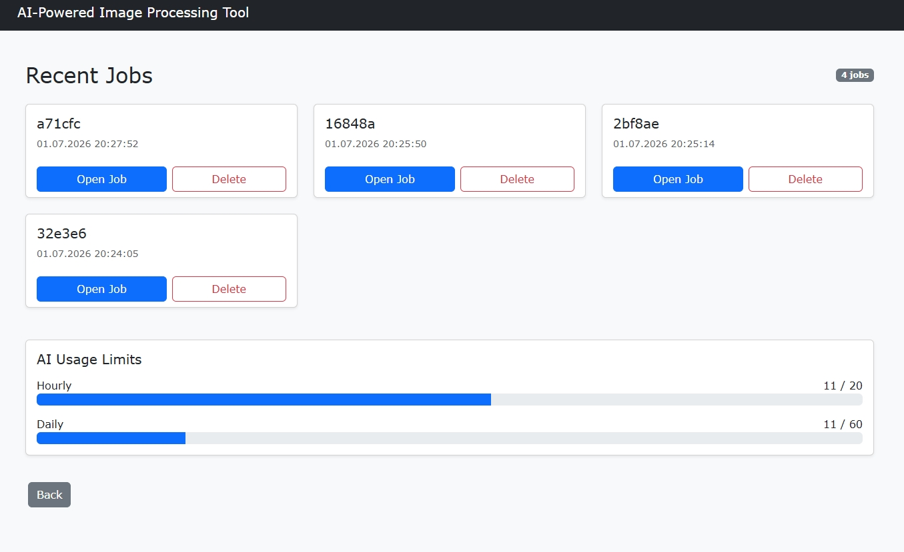

#### Linki

* [Działająca aplikacja](https://images.tigerstel.xyz)

* * *

## My-Books

Aplikacja webowa umożliwiająca budowanie własnej biblioteki książek poprzez integrację z Google Books API.

Projekt skupia się na zarządzaniu własną kolekcją, autoryzacji użytkowników oraz integracji z zewnętrznym API.

  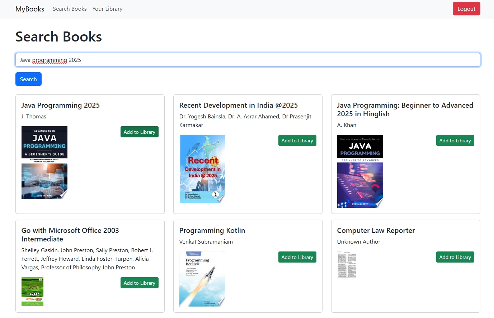

#### Technologie

* Aplikacja w części backendowej napisana w języku **Java** z wykorzystaniem frameworku **Spring**;
* Korzysta z relacyjnej bazy danych **PostgreSQL**;
* W warstwie frontendowej wykorzystano framework **React**
* Pozostałe technologie: **Liquibase**, **Docker**, **Gradle**, JWT

#### Funkcjonalności

* logowanie i rejestracja;
* wyszukiwanie książek przez Google Books API;
* dodawanie książek do własnej biblioteki;
* oznaczanie przeczytanych pozycji;
* paginacja wyników.

  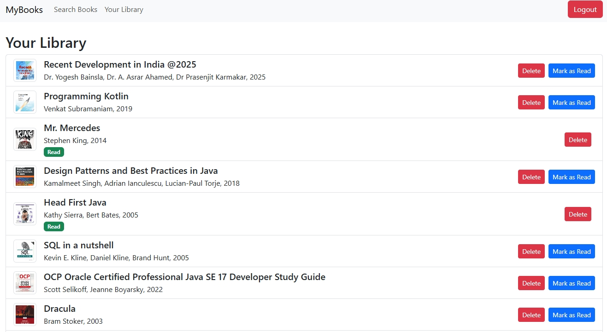

#### Linki

* [Działająca Aplikacja](https://mybooks.tigerstel.xyz/)
* [Kod projektu](https://github.com/TomaszGerstel/MyBooks.git)

* * *

## Utility Recorder

Desktopowe narzędzie do monitorowania zużycia mediów (np. prąd, woda) z możliwością trwałego zapisu danych, analizy oraz wizualizacji.

  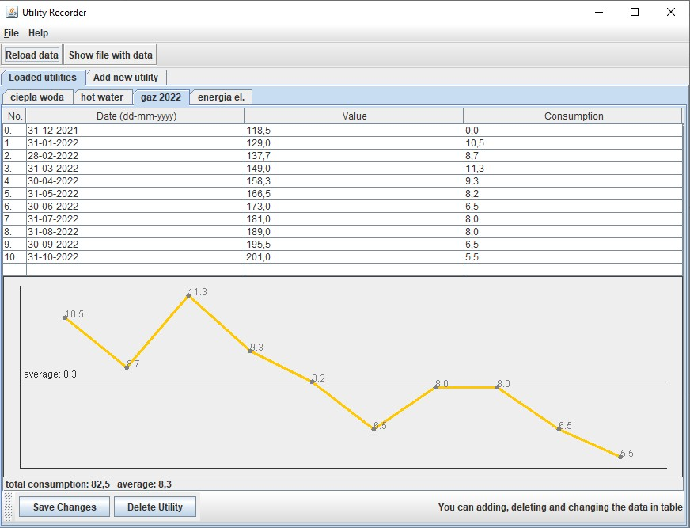

#### Technologie

* Aplikacja napisana w języku **Java**;
* Wykorzystano standardowe biblioteki do aplikacji okienkowych, jak **Swing**

#### Funkcjonalności

* zapis i edycja rekordów;
* analiza zużycia;
* wyliczanie średnich;
* generowanie wykresów.

#### Linki

* [Kod projektu](https://github.com/TomaszGerstel/utility-recorder.git)
* [Narzędzie do pobrania (jar)](https://s3-tiger-files-1.s3.us-east-1.amazonaws.com/utility_rec_0.1.jar)

* * *

## Gra logiczna: Number puzzle

Prosta gra logiczna, polegająca na przesuwaniu klocków w celu ułożenia ich w odpowiedniej kolejności.

  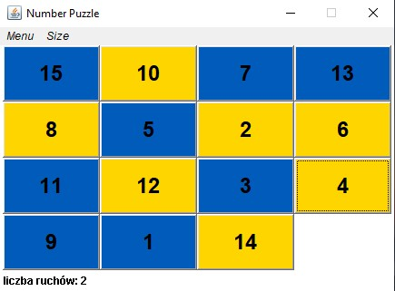

#### Technologie

* Java;
* Podstawowe biblioteki Javy do aplikacji okienkowych: Java AWT;

#### Funkcjonalności

* klocki automatycznie się mieszają podczas startu gry;
* możliwość zminy ilości klocków (poziomu) oraz resetu stanu gry;
* aplikacja zlicza ilość wykonanych ruchów oraz czas gry.

#### Linki

* [Plik exe do pobrania](https://s3-tiger-files-1.s3.us-east-1.amazonaws.com/number_puzzle1.0.exe)
* [Kod narzędzia](https://github.com/TomaszGerstel/number_puzzle.git)

 
# Więcej o mnie 
 

* Rocznik 1984, zamieszkały w Zielonej Górze.

* W latach 2003 - 2008 studia: Edukacja Techniczno-Informatyczna na Uniwersytecie Zielonogórskim.

* Wieloletnie doświadczenie w pracy na produkcji w charakterze nadzoru produkcji, ustawiania procesu i naprawy maszyn.

* Doświadczenie na stanowisku Operator CNC (a także kurs "Obsługa i programowanie obrabiarek sterowanych numerycznie").

* Lata 2020 - 2022: focus na programowanie oraz projekty niekomercyjne.

* 2020/2021 Studia Podyplomowe: Programowanie aplikacji Java, Wyższa Szkoła Bankowa we Wrocławiu.

* Obecnie mam dwuletnie doświadczenie (luty 2023 - styczeń 2025) na stanowisku Junior Software Developer w firmie z branży finansowej. Obejmowane stanowisko posiadało profil Java, a w praktyce dotyczyło programowania także w języku Kotlin, oraz obejmowało też pracę 'frontendową' z frameworkiem Angular i kilkoma innymi technologiami. 

* Czerwiec 2025: rozpoczęcie działalności godpodarczej (JDG) i realizacja zleceń związanych z tworzeniem, utrzymaniem 
i rozbudową projektów głownie w językach Java i Python. Rzeczwisty zakres działania obejmuje: backend, frontend i deployment.

* Grudzień 2025: zaliczenie testu i zdobycie cenionego certyfikatu Oracle Certified Professional: Java SE 17 Developer.

[`wróć`](#krtko-o-mnie)

### Kontakt

* gerstel.tomasz@gmail.com
* [linkedin.com/in/tgerstel](https://linkedin.com/in/tgerstel)
* [github.com](https://github.com/TomaszGerstel)