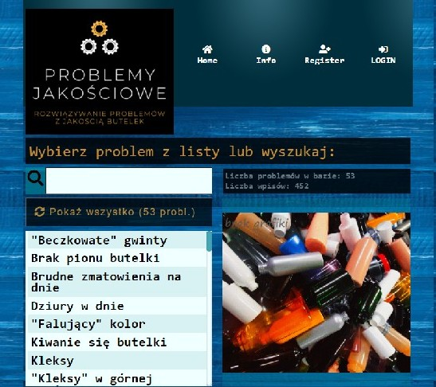

# Informacje

Prezentowana strona to coś na kształt osobistego portfolio. Ma ona na celu przedstawienie kwalifikacji programistycznych autora. Realizowane jest to poprzez prezentację przykładowo utworzonych narzędzi/aplikacji.

## Krótko o mnie

Programista Java (Junior level) plus frontend, bez formalnego doświadczenia komercyjnego w kierunku programowania. Mam na koncie kilka projektów narzędzi użytkowych (także wdrożonych na serwerach), które np. wspierają moją i innych pracę w zakładzie na produkcji. Wykształcenie Techniczno-Informatyczne (mgr inż.), Studia podyplomowe w zakresie Programowania w języku **Java** [`więcej`](#wicej-o-mnie)

## Technologie

- Java;
- Python (podstawowy);
- JavaScript;
- HTML, CSS;
- MySQL;
- Frameworki, interfejsy i standardy:
	- JakartaEE;
	- Spring Framework;
	- JDBC, JPA, Hibernate, CRUD;
	- AngularJS;
	- MySQL;
	- Jenkins

## Umiejętności

* Znajomość języka Java na poziomie średniozaawansowanym;
* Umiejętność pracy z HTML, CSS, JavaScript;
* Znajomość języka Python w stopniu podstawowym;
* Wiedza z zakresu obsługi baz danych i SQL;
* Podstawowa znajomość narzędzi kontroli wersji oraz ciągłej integracji (CI/CD) (GIT, Jenkins, Docker)

## Umiejętności w praktyce

* Praca w odpowiednim środowisku programistycznym (jak IntelliJ, Spring Tool Suite lub Android Studio), wybór odpowiednich zależności i umiejętność stworzenia w nim projektu w języku **Java** (aplikacje tradycyjne lub webowe, a także na systemy Android);

* Utworzenie bazy danych, która będzie współpracowała z projektem: ustalenie połączenia z bazą, wykorzystanie technologii mapowania obiektowo-relacyjnego w komunikacji między logiką aplikacji a bazą danych;

* Utworzenie warstwy widoku aplikacji, z wykorzystaniem technologii JPA (JakartaServerPages) lub szablonów (jak Thymeleaf), albo zastosowaniem bardziej zaawansowanego rozwiązania korzystając z frameworku AngularJS (może to być niezależna aplikacja);

* Umiejętność pisania testów do tworzonej aplikacji oraz zadbania o właściwą walidację danych przetwarzanych przez aplikację (JUnit, Mockito);

* Umiejętność implementacji procesu autoryzacji w tworzonej aplikacji (także z wykorzystaniem bazy danych);

* Instalacja niezbędnego oprogramowania na serwerze oraz wdrożenie aplikacji na serwer pod systemem Debian (także przypisanie domeny); 

* Korzystanie z narzędzi kontroli wersji jak GIT, z serwisu GitHub do współpracy z innymi, jak i do procesu ciągłej integracji oprogramowania (praca z narzędziem Jenkins);

* Umiejętność stworzenia projektu webowego w języku Pyton np. w środowisku PyCharm; 

* * *

# Moje Projekty

## Baza Problemów Jakościowych

Aplikacja obsługująca bazę problemów jakościowych (typowych wad i procedur postępowania) występujących w wyspecjalizowanym zakładzie produkującym butelki z tworzywa sztucznego.

#### Technologie

* Aplikacja napisana w języku **Java** z wykorzystaniem frameworka **Spring**;
* Korzysta z relacyjnej bazy danych **MySQL**;
* Warstwa widoku opracowana z wykorzystaniem **AngularJS**

#### Funkcjonalności

* Możliwość łatwego przeglądania i wyszukiwania dostępnych problemów jakościowych w bazie oraz wglądu w typowe przyczyny danego problemu oraz proponowane jego rozwiązania;
* Zaimplementowano usługę rejestracji i logowania;
* Dodano możliwość wprowadzania własnych przyczyn i rozwiązań danego problemu zalogowanemu użytkownikowi;

#### Linki

* [Aplikacja na serwerze](http://185.238.72.254/troubleshooting)
* [Kod projektu](https://github.com/TomaszGerstel/troubleshooting.git)

* * *

## Utility Recorder

Okienkowe narzędzie pomocne w monitorowaniu zużycia mediów, jak np. woda lub prąd (może służyć też do ewidencji innych rzeczy). Zapisuje dane w pliku, wczytuje je do tabeli i oblicza zużycie między rekordami, całkowite, a także średnie. Dane przedstawia na prostym wykresie.

#### Technologie

* Aplikacja napisana w języku **Java**;
* Wykorzystano standardowe biblioteki do aplikacji okienkowych, jak **Swing**

#### Funkcjonalności

* Tworzenie nowego rekordu, dodawanie wpisów do tabeli, edycja danych;
* Wyliczenia zużycia, średniej i podgląd danych na wykresie;
* Trwały zapis danych w pliku;
* Możliwość edycji danych z poziomu pliku

#### Linki

* [Kod projektu](https://github.com/TomaszGerstel/utility-recorder.git)
* [Narzędzie do pobrania (jar)](http://185.238.72.254/utility_rec_jar/utility_rec_0.1.jar)

* * *

## Py-Countant

Aplikacja pomocna w zarządzaniu finansami w małej działalności gospodarczej.
Po wprowadzeniu danych o rzeczywistych transakcjach przeprowadzanych w prowadzonej działalności, 
narzędzie pozwala ustalić uzyskiwane dochody, podstawę opodatkowania oraz wysokość podatków koniecznych do odprowadzenia, zależną od typu opodatkowania.

#### Technologie

* Aplikacja napisana w języku **Python** z wykorzystaniem technologii **FastAPI**;
* Korzysta z relacyjnej bazy danych **SQLite**;
* Pozostałe technologie to: **SQLAlchemy**, **Pydantic**, **Jinja2**

#### Funkcjonalności

* Rejestracja i logowanie użytkownika;
* Dodawanie i usuwanie rachunków/faktur, a następnie zatwierdzanie na ich podstawie transakcji (wychodzących lub przychodzących);
* Możliwość zdefiniowania transakcji specjalnej, jak opłata podatków lub wypłata wynagrodzenia;
* Obliczenia bilansu:
	* stan finansów;
	* przychody brutto;
	* koszta;
	* bilans netto;
	* vat;
	* podatek dochodowy do zapłacenia;
	* profit zależny od sposobu podatkowania;
	* opłacone podatki, podatki pozostałe;
	* wypłacony profit
* Wgląd w ostatnie transakcje, wyszukiwanie faktur i transakcji;
* Generowanie obliczeń dla wybranego zakresu dat;
* Obliczenia z danego miesiąca lub miesiąca poprzedniego

#### Linki

* [Kopia aplikacji na serwerze](http://py-countan,0t.com/)
* [Kod projektu](https://github.com/TomaszGerstel/pycountant-simple.git)

* * *

## Aplikacja monitorowania bilansu energetycznego

Mój projekt zaliczeniowy z kierunku Programowanie Aplikacji Java. Aplikacja jest dziennikiem żywieniowym/podejmowanych aktywności oraz przedstawia obliczenia osobistego bilansu energetycznego. W warstwie widoku wykorzystano szablony.

#### Technologie

* Aplikacja napisana w języku Java z wykorzystaniem frameworka Spring;
* Korzysta z relacyjnej bazy danych MySQL;
* W warstwie prezentacji zastosowano szablon widoków Thymeleaf

#### Funkcjonalności

* Logowanie i rejestracja realizowane przy pomocy bazy danych;
* Możliwość prowadzenia dziennika żywieniowego/aktywności – dodawania i usuwania wpisów;
* Baza posiłków i aktywności, z której można dodawać pozycje do swojego dziennika;
* Możliwość uzupełniania bazy o nowe posiłki i aktywności;
* Obliczenia bilansu dla dowolnego zakresu i jego ocena na podstawie ustalonego zapotrzebowania użytkownika; 
* Wyliczenie i ocena wskaźnika BMI;
* Możliwość wglądu i edycji danych użytkownika

#### Linki

* [Działająca Aplikacja MyBalance](http://185.238.72.254/mybalance/).

* * *

## Kalkulator Realizacji Produkcji

Proste narzędzie obliczające przewidywany czas realizacji produkcji i inne wartości na podstawie wprowadzonych danych, jak czas cyklu maszyny, wielkość produkcji oraz waga produktu. Przydatne do codziennego nadzoru produkcji w zakładzie produkującym opakowania w procesie "wtrysko-rozdmuchu".

#### Technologie

* HTML, CSS;
* Obliczenia w JavaScript;

#### Funkcjonalności

* Możliwość szybkiego obliczenia realizacji produkcji i uzyskania konkretnej godziny realizacji na stronie internetowej bez konieczności wykonywania skomplikowanych wyliczeń (jak chociażby "ręcznego" przeliczania sekund na godziny i minuty oraz dodawania do godziny obecnej);
* Uzyskanie dodatkowych informacji, jak: wydajność i waga potrzebnego surowca do danej produkcji.

#### Linki

* [Działające narzędzie](http:185.238.72.254/kalkulator)
* [Kod narzędzia](https://github.com/TomaszGerstel/kalkulator.git)

* * *

## Kalkulator Realizacji Produkcji – Android

Wersja na systemy Android narzędzia obliczającego przewidywany czas realizacji produkcji i inne wartości na podstawie wprowadzonych danych, jak czas cyklu maszyny, wielkość produkcji oraz waga produktu. Narzędzie jest przydatne do codziennego nadzoru produkcji w zakładzie produkującym opakowania w procesie "wtrysko-rozdmuchu".

#### Technologie

* Java z odpowiednimi klasami dla Androida;
* Interfejs użytkownika w odpowiednich znacznikach XML;

#### Funkcjonalności

* Możliwość szybkiego obliczenia realizacji produkcji i uzyskania konkretnej godziny realizacji w pobranym i zainstalowanym narzędziu ofline bez konieczności wykonywania skomplikowanych wyliczeń (jak chociażby "ręcznego" przeliczania sekund na godziny i minuty oraz dodawania do godziny obecnej);
* Uzyskanie dodatkowych informacji, jak: wydajność i waga potrzebnego surowca do danej produkcji.

#### Linki

* [Narzędzie do pobrania](http://185.238.72.254/kalkulator_android/kalkulator_android_1.0.apk)
* [Kod narzędzia](https://github.com/TomaszGerstel/calc_for_android.git)

* * *

## Gra logiczna: Number puzzle

Prosta gra logiczna, polegająca na przesuwaniu klocków w celu ułożenia ich w 
odpowiedniej kolejności.

#### Technologie

* Java;
* Podstawowe biblioteki Javy do aplikacji okienkowych: Java AWT;

#### Funkcjonalności

* Klocki automatycznie się mieszają podczas startu gry;
* Możliwość zminy ilości klocków (poziomu) oraz resetu stanu gry;
* Aplikacja zlicza ilość wykonanych ruchów oraz czas gry.

#### Linki

* [Plik exe do pobrania](http://185.238.72.254/number_puzzle/number_puzzle1.0.exe)
* [Kod narzędzia](https://github.com/TomaszGerstel/number_puzzle.git)

* * *

# Więcej o mnie

* Rocznik 1984, zamieszkały w Zielonej Górze;

* W latach 2003 -2008 studia: Edukacja Techniczno-Informatyczna na Uniwersytecie Zielonogórskim, gdzie między innymi nabyłem podstawową wiedzę na temat informatyki i programowania (informatyka ogólna, HTML i języki programowania - głównie Turbo Pascal) oraz zdobyłem przygotowanie pedagogiczne do nauczania techniki i informatyki (praktyki z nauczania informatyki);

* Lata 2020/2021 Studia Podyplomowe: Programowanie aplikacji Java, Wyższa Szkoła Bankowa we Wrocławiu;

* Posiadam wieloletnie doświadczenie w pracy na produkcji w charakterze nadzoru produkcji, ustawiania procesu i naprawy maszyn;

* Doświadczenie na stanowisku Operator CNC (a także kurs "Obsługa i programowanie obrabiarek sterowanych numerycznie");

* Mimo, iż nie pracowałem w sektorze informatycznym, posiadam pewną wiedzę informatyczną (także programistyczną) zdobytą przed laty oraz od lat interesowałem się sterowaniem i kontrolą procesu produkcji w przemyśle (zainteresowanie automatyką, maszynami CNC, próby założenia działalności opartej na wytwarzaniu produktu na maszynach sterowanych numerycznie);

* W ostatnich latach postanowiłem zainteresować się "typowym" programowaniem oraz bardziej "nowoczesnym" językiem (w przeciwieństwie do Pascal’a), jak Java , aby w przyszłości móc zmienić charakter swojej pracy na bardziej niezależny i uniwersalny, niezwiązany bezpośrednio z pracą na produkcji;

* W ostatnim czasie postanowiłem z własnej inicjatywy (ponad swoje obowiązki zawodowe) utworzyć narzędzia produkcyjne opisywane powyżej, które pomagają niektórym pracownikom nadzorować produkcję w zakładzie, gdzie do niedawna byłem zatrudniony (wrzesień 2022).

[`wróć`](#informacje)

### Kontakt

* gerstel.tomasz@gmail.com
* [linkedin.com/in/tgerstel](https://linkedin.com/in/tgerstel)
* [github.com](https://github.com/TomaszGerstel)