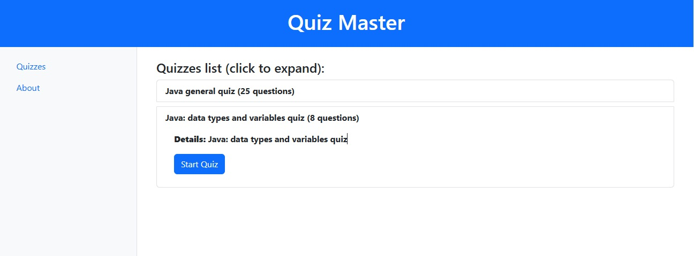
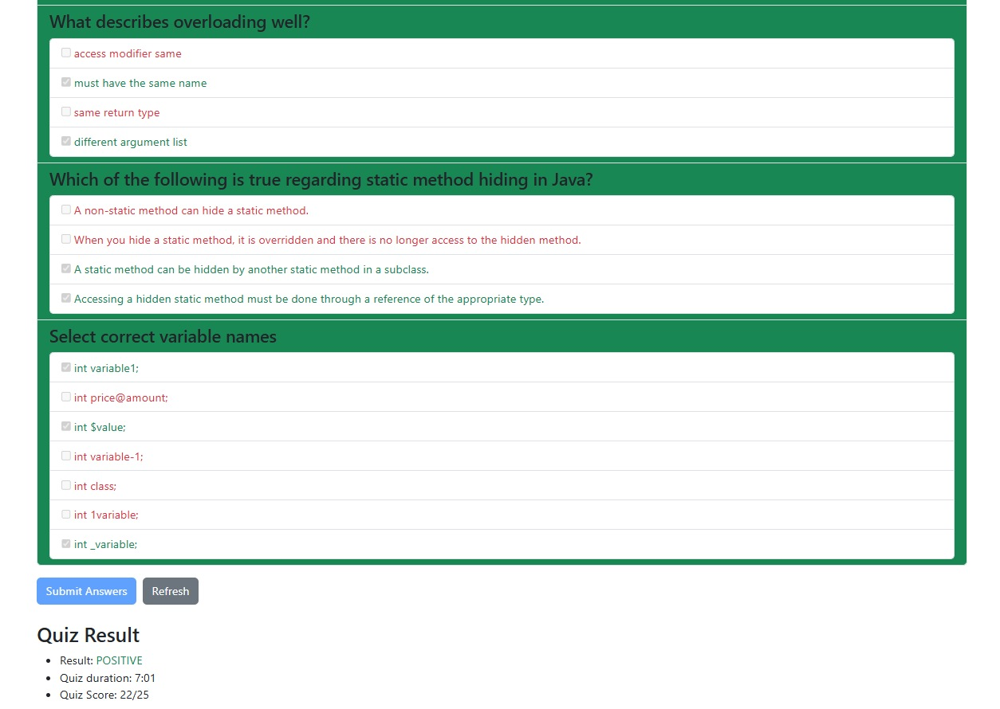

## Krótko o mnie

W obecnej chwili (od czerwiec 2025) jestem programistą 'freelancerem' i, w ramach działalności gospodarczej (JDG), realizuję zadania związane z utrzymaniem,
rozbudową i tworzeniem serwisów webowych, głównie z wykorzystaniem Javy i Pythona (plus rozwiązania 'frontendowe').

Posiadam dwuletnie doświadczenie komercyjne na stanowisku Junior Software Developer w firmie z branży finansowej. 
Dodatkowo kilkuletnie doświadczenie niekomercyjne związane z tworzeniem projektów narzędzi użytkowych (także wdrożonych na serwerach),
które np. wspierały w przeszłości moją pracę i pracę innych w zakładzie produkcyjnym.
Mam wykształcenie Techniczno-Informatyczne (mgr inż.) oraz Studia podyplomowe 
w zakresie Programowania w języku **Java** [`więcej`](#wicej-o-mnie)

## Technologie, w których pracuję

- Java;
- Kotlin;
- JavaScript / TypeScript;
- Python (podstawowy);
- PHP (podstawowy);
- HTML, CSS;
- SQL;

#### Frameworki, interfejsy i standardy:	

- Spring Framework;
- JakartaEE;
- JDBC, JPA, Hibernate, CRUD;
- Angular, AngularJS;
- MySQL, PostgreSQL, MongoDB;
- JUnit, Spock, Mockito;
- Docker;
- Jenkins

## Umiejętności

* Znajomość języka Java oraz Kotlin na poziomie średniozaawansowanym oraz doświadczenie w rozwijaniu aplikacji w tych językach;
* Umiejętność pracy z HTML, CSS, JavaScript a także z frameworkami Angular i AngularJS oraz komercyjne doświadczenie w rozwijaniu serwisów z wykorzystaniem Angular;
* Znajomość innych języków w stopniu podstawowym, jak Python, PHP;
* Wiedza i doświadczenie z zakresu obsługi relacyjnych baz danych i SQL, a także, w mniejszym stopniu z bazami nierelacyjnymi, jak MongoDB;
* Znajomość narzędzi kontroli wersji oraz ciągłej integracji (CI/CD) (GIT, Jenkins, Docker);
* Doświadczenie i umiejętność współpracy w zespole programistów z wykorzystaniem systemów kontroli wersji;
* Praktyczne doświadczenie pracy w metodykach Agile (Jira, Confluence).

## Umiejętności w praktyce

* Praca w odpowiednim środowisku programistycznym (jak IntelliJ, PyCharm, SpringToolSuite, AndroidStudio albo VisualStudioCode), wybór odpowiednich zależności i umiejętność stworzenia w nim projektu w języku **Java**, **Kotlin**, **Python** lub **JavaScript** (aplikacje tradycyjne lub webowe, a także na systemy Android);

* Utworzenie bazy danych, która będzie współpracowała z projektem: ustalenie połączenia z bazą, wykorzystanie technologii mapowania obiektowo-relacyjnego w komunikacji między logiką aplikacji a bazą danych;

* Utworzenie warstwy widoku aplikacji, z wykorzystaniem technologii JPA (JakartaServerPages) lub szablonów (jak Thymeleaf), albo zastosowaniem bardziej zaawansowanego rozwiązania korzystając z frameworku Angular lub AngularJS (niezależna aplikacja);

* Umiejętność pisania testów do tworzonej aplikacji oraz zadbania o właściwą walidację danych przetwarzanych przez aplikację (JUnit, Mockito, Spock);

* Umiejętność implementacji procesu autoryzacji w tworzonej aplikacji (także z wykorzystaniem bazy danych);

* Instalacja niezbędnego oprogramowania na serwerze oraz wdrożenie aplikacji na serwer pod systemem Debian (także przypisanie domeny); 

* Korzystanie z narzędzi kontroli wersji jak GIT, z serwisu GitHub (lub Bitbucket) do współpracy z innymi, jak i do procesu ciągłej integracji oprogramowania (praca z narzędziem Jenkins);

* * *

# Moje Projekty

## Quiz Master

```
Jest to obecnie rozwijany nowy projekt (posiadający już podstawową funkcjonalność)
Charakterystyka technologiczna: 
	> Java, Spring, Angular, 
	> MongoDB, Liquibase,
	> Groovy, Spock, JUnit
```
Aplikacja dająca możliwość nauki i sprawdzenia się poprzez przerabianie 'quizów' np. związanych z nauką programowania w Javie albo w dowolnym innym temacie.
Obecnie są dostępne przykładowe quizy związane z nauką Javy, nie ma możliwości ani potrzeby logowania się do serwisu. Rejestrowany jest jedynie czas wykonania testu. 

#### Działanie

W aplikacji jest wyświetlana lista dostępnych quizów. Po wybraniu quizu należy kliknąć 'start quiz' 
(załadują się pytania z odpowiedziami i quiz rozpocznie się). 
Po wyborze odpowiedzi quiz należy przesłać do 'backendu', aby otrzymać informacje o wyniku. 
Na wynik zawiera się ocena (pozytywna/negatywna), liczba prawidłowych odpowiedzi i czas odpowiedzi 
(liczony od 'kliknięcia' na wybrany quiz w 'backendzie' na podstawie wygenerowanego 'session id').

Wraz z wynikiem zwracane są także poprawne odpowiedzi, 
dzięki czemu na 'frontendzie' zaimplementowano zmianę kolorystyki, po zakonczonym teście, 
poprawnych/nieprawidłowych odpowiedzi w formularzu (a także całych pytań w zależności od oceny odpowiedzi).

#### Technologie

* Część 'backendowa' aplikacji napisana w języku **Java** z wykorzystaniem frameworka **Spring**;
* 'Frontend' utworzony przy pomocy frameworka **Angular**, z wykorzystaniem Bootstrap;
* Korzysta z nierelacyjnej bazy danych **MongoDB** i narzędzia **Liquibase** do migracji;
* Pisząc testy korzystano (poza **Java**) z jezyka **Groovy** oraz z biblioteki **Spock** oraz **RestAssured**;



#### Cechy aplikacji

* Koncepcja przeprowadzania różnego rodzaju testów/quizów z wykorzystaniem 'backendu' i bazy danych pozwala na:
	* zapewnienie wysokiej jakości wyników, ponieważ przesyłane dane z pytaniami do 'frontendu' nie zawierają wyników oraz ograniczone są możliwości manipulacji czasem wykonania testu bo czas ten jest liczony w 'backendzie';
	* dodawanie quizów oraz ich rozbudowę;
	* rejestrację wyników;
	* każdorazowe 'mieszanie' kolejności pytań oraz odpowiedzi w ramach pytania;
	* edycję parametrów, jak np. współczynnika zaliczenia testu.

#### Planowane Funkcjonalności

* Rejestracja i logowanie użytkownika;
* Odliczanie czasu trawania quizu i zwracanie szczegółowych informacji na temat wyniku;
* Rejestrowanie wyników;
* Możliwość dodawania quizów i edycji;



#### Linki

* [Działająca aplikacja](https://quizmaster.tigerstel.xyz)
* [Kod projektu](https://github.com/TomaszGerstel/QuizMaster.git)

* * *

## J-Countant

Aplikacja pomocna w zarządzaniu finansami w małej działalności gospodarczej (zmodyfikowana wersja aplikacji napisanej pierwotnie w języku Python, 
z wykorzystaniem innych technologii). Na narzędzie składają się dwie odrębne aplikacje (osobno zdefiniowano 'frontend' i odrębnie 'backend').

Po wprowadzeniu danych o rzeczywistych transakcjach przeprowadzanych w prowadzonej działalności, 
narzędzie pozwala ustalić uzyskiwane dochody, podstawę opodatkowania oraz wysokość podatków koniecznych do odprowadzenia, zależną od typu opodatkowania.

#### Charakterystyka

Aplikacja napisana w architekturze **REST**, pracująca na danych zapisywanych w bazie **PostgreSQL**. 
Część 'back-endowa' została aktualnie zaimplementowana wraz z bazą danych w kontenerach **Dockera** na serwerze VPS pod systemem **Debian**.
Część 'frontendową', komunikującą się z częścią 'back-endową', umieszczono w innej lokalizacji z wykorzystaniem usługi oferowanej przez Amazon Web Services (**AWS**).


#### Technologie

* Część 'backendowa' aplikacji napisana w języku **Java** z wykorzystaniem frameworku **Spring**;
* Korzysta z relacyjnej bazy danych **PostgreSQL**;
* Wykorzystane komponenty Spring: **Spring Security**, **Spring Web**, **Spring Data**;
* Pozostałe technologie to: **JPA**, **Hibernate**, **Liquibase**, **Hibernate Validator**;
* Narzędzia wykorzystane w testowaniu aplikacji: **JUnit**, **Mockito**, **AssertJ**, **Testcontainers**;
* Technologie, których użyto do wdrażania aplikacji: **Git**, **Docker**, **Docker Compose**, **AWS**;
* Część 'front-endowa' zrealizowana przy pomocy frameworku **AngularJS**

#### Funkcjonalności

* Rejestracja i logowanie użytkownika;
* Dodawanie i usuwanie rachunków/faktur, a następnie zatwierdzanie na ich podstawie transakcji (wychodzących lub przychodzących);
* Możliwość zdefiniowania transakcji specjalnej, jak opłata podatków lub wypłata wynagrodzenia;
* Obliczenia bilansu:
	* stan finansów;
	* przychody brutto;
	* koszta;
	* bilans netto;
	* vat;
	* podatek dochodowy do zapłacenia;
	* profit zależny od sposobu opodatkowania;
	* opłacone podatki, podatki pozostałe;
	* wypłacony profit
* Wgląd w ostatnie transakcje, wyszukiwanie faktur i transakcji;
* Generowanie obliczeń dla wybranego zakresu dat;
* Obliczenia z danego miesiąca lub miesiąca poprzedniego


#### Linki

* [Działająca aplikacja](http://jcountant.s3-website.eu-west-3.amazonaws.com)
* [Kod projektu - front](https://github.com/TomaszGerstel/JCountant_front.git)
* [Kod projektu - back](https://github.com/TomaszGerstel/JCountant.git)

* * *

## Baza Problemów Jakościowych

Aplikacja obsługująca bazę problemów jakościowych (typowych wad i procedur postępowania) występujących w wyspecjalizowanym zakładzie produkującym butelki z tworzywa sztucznego.


#### Technologie

* Aplikacja napisana w języku **Java** z wykorzystaniem frameworku **Spring**;
* Korzysta z relacyjnej bazy danych **MySQL**;
* Warstwa widoku opracowana z wykorzystaniem **AngularJS**

#### Funkcjonalności

* Możliwość łatwego przeglądania i wyszukiwania dostępnych problemów jakościowych w bazie oraz wglądu w typowe przyczyny danego problemu oraz proponowane jego rozwiązania;
* Zaimplementowano usługę rejestracji i logowania;
* Dodano możliwość wprowadzania własnych przyczyn i rozwiązań danego problemu zalogowanemu użytkownikowi;

#### Linki

* [Aplikacja na serwerze](http://185.238.72.254/troubleshooting)
* [Kod projektu](https://github.com/TomaszGerstel/troubleshooting.git)

* * *

## Utility Recorder

Okienkowe narzędzie pomocne w monitorowaniu zużycia mediów, jak np. woda lub prąd (może służyć też do ewidencji innych rzeczy). Zapisuje dane w pliku, wczytuje je do tabeli i oblicza zużycie między rekordami, całkowite, a także średnie. Dane przedstawia na prostym wykresie.


#### Technologie

* Aplikacja napisana w języku **Java**;
* Wykorzystano standardowe biblioteki do aplikacji okienkowych, jak **Swing**

#### Funkcjonalności

* Tworzenie nowego rekordu, dodawanie wpisów do tabeli, edycja danych;
* Wyliczenia zużycia, średniej i podgląd danych na wykresie;
* Trwały zapis danych w pliku;
* Możliwość edycji danych z poziomu pliku

#### Linki

* [Kod projektu](https://github.com/TomaszGerstel/utility-recorder.git)
* [Narzędzie do pobrania (jar)](http://185.238.72.254/utility_rec_jar/utility_rec_0.1.jar)

* * *

## Py-Countant

Aplikacja pomocna w zarządzaniu finansami w małej działalności gospodarczej.
Po wprowadzeniu danych o rzeczywistych transakcjach przeprowadzanych w prowadzonej działalności, 
narzędzie pozwala ustalić uzyskiwane dochody, podstawę opodatkowania oraz wysokość podatków koniecznych do odprowadzenia, zależną od typu opodatkowania.


#### Technologie

* Aplikacja napisana w języku **Python** z wykorzystaniem technologii **FastAPI**;
* Korzysta z relacyjnej bazy danych **SQLite**;
* Pozostałe technologie to: **SQLAlchemy**, **Pydantic**, **Jinja2**

#### Funkcjonalności

* Rejestracja i logowanie użytkownika;
* Dodawanie i usuwanie rachunków/faktur, a następnie zatwierdzanie na ich podstawie transakcji (wychodzących lub przychodzących);
* Możliwość zdefiniowania transakcji specjalnej, jak opłata podatków lub wypłata wynagrodzenia;
* Obliczenia bilansu:
	* stan finansów;
	* przychody brutto;
	* koszta;
	* bilans netto;
	* vat;
	* podatek dochodowy do zapłacenia;
	* profit zależny od sposobu opodatkowania;
	* opłacone podatki, podatki pozostałe;
	* wypłacony profit
* Wgląd w ostatnie transakcje, wyszukiwanie faktur i transakcji;
* Generowanie obliczeń dla wybranego zakresu dat;
* Obliczenia z danego miesiąca lub miesiąca poprzedniego

#### Linki

* [Aplikacja na serwerze](https://pycountant.tigerstel.xyz)
* [Kod projektu](https://github.com/TomaszGerstel/pycountant-simple.git)

* * *

## Aplikacja monitorowania bilansu energetycznego

Mój projekt zaliczeniowy z kierunku Programowanie Aplikacji Java. Aplikacja jest dziennikiem żywieniowym/podejmowanych aktywności oraz przedstawia obliczenia osobistego bilansu energetycznego. W warstwie widoku wykorzystano szablony.


#### Technologie

* Aplikacja napisana w języku Java z wykorzystaniem frameworku Spring;
* Korzysta z relacyjnej bazy danych MySQL;
* W warstwie prezentacji zastosowano szablon widoków Thymeleaf

#### Funkcjonalności

* Logowanie i rejestracja realizowane przy pomocy bazy danych;
* Możliwość prowadzenia dziennika żywieniowego/aktywności – dodawania i usuwania wpisów;
* Baza posiłków i aktywności, z której można dodawać pozycje do swojego dziennika;
* Możliwość uzupełniania bazy o nowe posiłki i aktywności;
* Obliczenia bilansu dla dowolnego zakresu i jego ocena na podstawie ustalonego zapotrzebowania użytkownika; 
* Wyliczenie i ocena wskaźnika BMI;
* Możliwość wglądu i edycji danych użytkownika

#### Linki

* [Działająca Aplikacja MyBalance](http://185.238.72.254/mybalance/)

* * *

## Kalkulator Realizacji Produkcji

Proste narzędzie obliczające przewidywany czas realizacji produkcji i inne wartości na podstawie wprowadzonych danych, jak czas cyklu maszyny, wielkość produkcji oraz waga produktu. Przydatne do codziennego nadzoru produkcji w zakładzie produkującym opakowania w procesie "wtrysko-rozdmuchu".


#### Technologie

* HTML, CSS;
* Obliczenia w JavaScript;

#### Funkcjonalności

* Możliwość szybkiego obliczenia realizacji produkcji i uzyskania konkretnej godziny realizacji na stronie internetowej bez konieczności wykonywania skomplikowanych wyliczeń (jak chociażby "ręcznego" przeliczania sekund na godziny i minuty oraz dodawania do godziny obecnej);
* Uzyskanie dodatkowych informacji, jak: wydajność i waga potrzebnego surowca do danej produkcji.

#### Linki

* [Działające narzędzie](http://185.238.72.254/kalkulator)
* [Kod narzędzia](https://github.com/TomaszGerstel/kalkulator.git)

* * *

## Kalkulator Realizacji Produkcji – Android

Wersja na systemy Android narzędzia obliczającego przewidywany czas realizacji produkcji i inne wartości na podstawie wprowadzonych danych, jak czas cyklu maszyny, wielkość produkcji oraz waga produktu. Narzędzie jest przydatne do codziennego nadzoru produkcji w zakładzie produkującym opakowania w procesie "wtrysko-rozdmuchu".


#### Technologie

* Java z odpowiednimi klasami dla Androida;
* Interfejs użytkownika w odpowiednich znacznikach XML;

#### Funkcjonalności

* Możliwość szybkiego obliczenia realizacji produkcji i uzyskania konkretnej godziny realizacji w pobranym i zainstalowanym narzędziu ofline bez konieczności wykonywania skomplikowanych wyliczeń (jak chociażby "ręcznego" przeliczania sekund na godziny i minuty oraz dodawania do godziny obecnej);
* Uzyskanie dodatkowych informacji, jak: wydajność i waga potrzebnego surowca do danej produkcji.

#### Linki

* [Narzędzie do pobrania](http://185.238.72.254/kalkulator_android/kalkulator_android_1.0.apk)
* [Kod narzędzia](https://github.com/TomaszGerstel/calc_for_android.git)

* * *

## Gra logiczna: Number puzzle

Prosta gra logiczna, polegająca na przesuwaniu klocków w celu ułożenia ich w 
odpowiedniej kolejności.


#### Technologie

* Java;
* Podstawowe biblioteki Javy do aplikacji okienkowych: Java AWT;

#### Funkcjonalności

* Klocki automatycznie się mieszają podczas startu gry;
* Możliwość zminy ilości klocków (poziomu) oraz resetu stanu gry;
* Aplikacja zlicza ilość wykonanych ruchów oraz czas gry.

#### Linki

* [Plik exe do pobrania](http://185.238.72.254/number_puzzle/number_puzzle1.0.exe)
* [Kod narzędzia](https://github.com/TomaszGerstel/number_puzzle.git)

* * *

# Więcej o mnie 

* Rocznik 1984, zamieszkały w Zielonej Górze.

* W latach 2003 - 2008 studia: Edukacja Techniczno-Informatyczna na Uniwersytecie Zielonogórskim, gdzie między innymi nabyłem podstawową wiedzę na temat informatyki i programowania (informatyka ogólna, HTML i języki programowania - głównie Turbo Pascal) oraz zdobyłem przygotowanie pedagogiczne do nauczania techniki i informatyki (praktyki z nauczania informatyki).

* Posiadam wieloletnie doświadczenie w pracy na produkcji w charakterze nadzoru produkcji, ustawiania procesu i naprawy maszyn.

* Doświadczenie na stanowisku Operator CNC (a także kurs "Obsługa i programowanie obrabiarek sterowanych numerycznie").

* Ostatnie kilka lat (przed podjęciem pracy w IT) to postanowianie zainteresowania się "typowym" programowaniem oraz bardziej "nowoczesnym" językiem (w przeciwieństwie do Pascal’a), jak Java, aby w przyszłości móc zmienić charakter swojej pracy na bardziej niezależny i uniwersalny, niezwiązany bezpośrednio z pracą na produkcji.

* Jeszcze pracując w zakładzie produkcyjnym, postanowiłem z własnej inicjatywy (ponad swoje obowiązki zawodowe) utworzyć narzędzia produkcyjne opisywane powyżej, które pomagają niektórym pracownikom nadzorować produkcję w zakładzie, gdzie byłem zatrudniony do wrzesinia 2022.

* Lata 2020/2021 Studia Podyplomowe: Programowanie aplikacji Java, Wyższa Szkoła Bankowa we Wrocławiu.

* Obecnie mam dwuletnie doświadczenie (luty 2023 - styczeń 2025) na stanowisku Junior Software Developer w firmie z branży finansowej. Obejmowane stanowisko posiadało profil Java, a w praktyce dotyczyło programowania także w języku Kotlin, oraz obejmowało też pracę 'frontendową' z frameworkiem Angular i kilkoma innymi technologiami. 

* Czerwiec 2025: rozpoczęcie działalności godpodarczej (JDG) i realizacja zleceń związanych z tworzeniem, utrzymaniem 
i rozbudową projektów głownie w językach Java i Python. Rzeczwisty zakres działąnia obejmuje: backend, frontend i deployment.

[`wróć`](#krtko-o-mnie)


### Kontakt

* gerstel.tomasz@gmail.com
* [linkedin.com/in/tgerstel](https://linkedin.com/in/tgerstel)
* [github.com](https://github.com/TomaszGerstel)