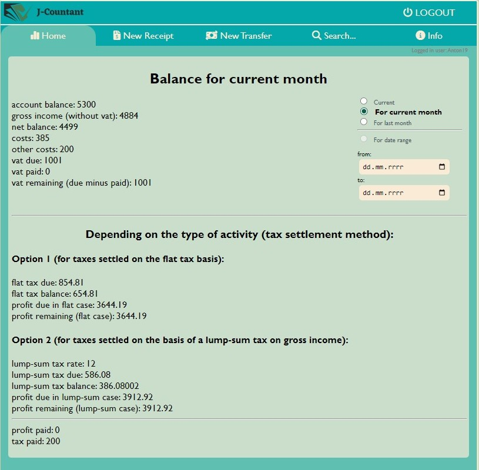
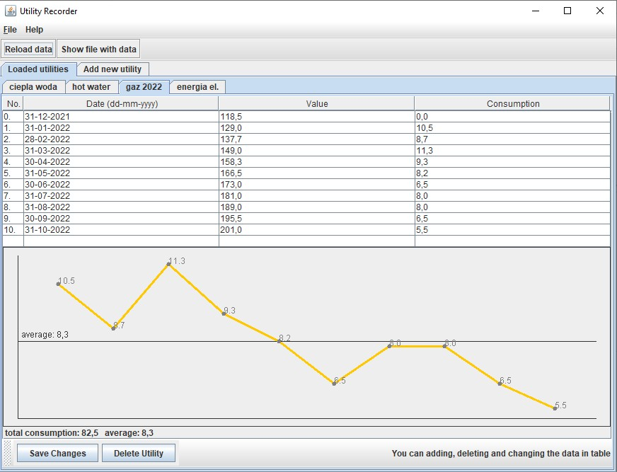
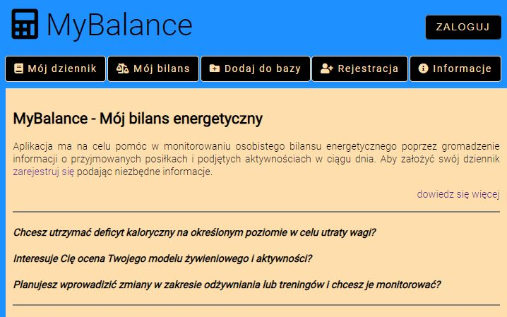
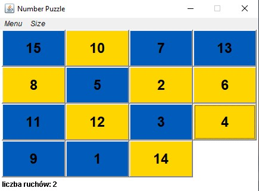

# Information

The presented website is something in the shape of a personal portfolio. It aims to present my programming qualifications. This is done by presenting examples of created tools/applications.

## Briefly about me

Java programmer (Junior level) plus frontend, without formal commercial experience in programming. I have several projects of utility tools (also implemented on servers) that, for example, support my and others' work in the production plant. "Technical and IT" studies (master), Postgraduate studies in Programming in **Java** [`more`](#more-about-me)

## Technologies

- Java;
- Python (basic);
- JavaScript;
- HTML, CSS;
- MySQL;
- Frameworks, interfaces and standards:
	- JakartaEE;
	- Spring Framework;
	- JDBC, JPA, Hibernate, CRUD;
	- AngularJS;
	- MySQL;
	- Jenkins

## Skills

* Intermediate level of Java language;;
* Ability to work with JavaScript, HTML and CSS;
* Basic level of Python;
* Knowledge of databases and SQL;
* Basic knowledge of version control and continuous integration and delivery tools (CI/CD) (GIT, Jenkins, Docker)

## Practical skills

* Working in the appropriate development environment (such as IntelliJ, Spring Tool Suite or Android Studio), choosing the right dependencies and the ability to create a project in **Java** (traditional or web applications, also for Android systems);

* Creating a database that will cooperate with the project: establishing a connection with the database, using object-relational mapping technology in communication between the application logic and the database;

* Creating an application view layer, using JPA technology (JakartaServerPages) or templates (like Thymeleaf). Also working with a more advanced solution using the AngularJS framework (it can be a separate application);

* Ability to write tests for the created application and ensure proper validation of data processed by the application (JUnit, Mockito);

* Ability to implement the authorization process in the created application (also using a database);

* Installation of the necessary software on the server and deployment of the application to the server under the Debian system (including domain assignment);

* Using version control tools such as GIT (GitHub) for collaboration with others and for continuous software delivery (Jenkins);

* Ability to create a web project in Python, e.g. in the PyCharm environment;

* * *

# My Projects

## J-Countant

The application helpful in managing finances in a small business (a modified version of the application originally written in Python,
using other technologies). The tool consists of two separate applications ('front-end' and 'back-end' are defined separately).

After entering data on actual transactions carried out in the business,
the tool allows you to determine the profit, the tax base and the amount of taxes necessary to pay (depending on the type of taxation).

#### Characteristics

Application written in the **REST** architecture, working on data stored in the **PostgreSQL** database.
The 'back-end' part has now been implemented along with the database in **Docker** containers on a VPS server under **Debian**.
The 'front-end' part, communicating with the 'back-end' part, was placed in a different location using a simple service offered by Amazon Web Services (**AWS**).

#### Technologies

* 'Back-end' part of the application written in **Java** using the **Spring** framework;
* Uses a relational database **PostgreSQL**;
* Used Spring components: **Spring Security**, **Spring Web**, **Spring Data**;
* Other technologies: **JPA**, **Hibernate**, **Liquibase**, **Hibernate Validator**;
* Tools used in application testing: **JUnit**, **Mockito**, **AssertJ**;
* Technologies used to deploy the application: **Git**, **Docker**, **Docker Compose**, **AWS**;
* The 'front-end' part implemented with **AngularJS** framework

#### Functionalities

* Login and new user registration;
* Adding and deleting receipts/invoices, and then approving transactions based on them (outgoing or incoming);
* Ability to define a special transaction, such as tax payment or salary payment;
* Balance calculation:
	* state of finances;
	* gross income;
	* costs;
	* net balance;
	* VAT;
	* income tax to pay;
	* profit depends on the method of taxation;
	* paid taxes, remaining tax to pay;
	* paid profit
* Insight into recent transactions, search for invoices and transactions;
* Generate calculations for a selected date range;
* Calculations for the current or previous month

#### Links

* [Front-end supporting the backend application](http://jcountant.s3-website.eu-west-3.amazonaws.com)
* [Project code - front](https://github.com/TomaszGerstel/JCountant_front.git)
* [Project code - back](https://github.com/TomaszGerstel/JCountant.git)

* * *

## Quality Troubles Database

An application supporting a database of quality problems (typical defects and procedures for improvement) occurring in a specialized plant producing plastic bottles.

#### Technologies

* Application written in **Java** using the **Spring** framework;
* Uses **MySQL** relational database;
* View layer developed with **AngularJS**

#### Functionalities

* The ability to easily browse and search for available quality problems in the database and view the typical causes of a given problem and its proposed solutions;
* Registration and login service implemented;
* The ability to enter your own causes and solutions to a given problem to the logged-in user;

#### Lins

* [App on server](http://185.238.72.254/troubleshooting)
* [Project code](https://github.com/TomaszGerstel/troubleshooting.git)

* * *

## Utility Recorder

A desktop tool helpful in monitoring the consumption of utilities, such as water or electricity (it can also be used to record other things). It saves the data to a file, reads it into a table and calculates consumption between records, totals and averages. The data is presented in a simple graph.

#### Technologies

* Application written in **Java**;
* Standard libraries for window applications like **Swing** were used

#### Functionalities

* Creating a new record, adding table entries, editing data;
* Calculation of consumption, average and preview of data on the diagram;
* Permanent recording of data in a file;
* Ability to edit data from the file level

#### Linki

* [Project code](https://github.com/TomaszGerstel/utility-recorder.git)
* [jar to download](http://185.238.72.254/utility_rec_jar/utility_rec_0.1.jar)

* * *

## Py-Countant

The application helpful in managing finances in a small business.
After entering data on actual transactions carried out in the business,
the tool allows you to determine the profit, the tax base and the amount of taxes necessary to pay (depending on the type of taxation).

#### Technologies

* Application written in **Python** using **FastAPI** technology;
* Uses **SQLite** relational database;
* Other technologies: **SQLAlchemy**, **Pydantic**, **Jinja2**

#### Functionalities

* Login and new user registration;
* Adding and deleting receipts/invoices, and then approving transactions based on them (outgoing or incoming);
* Ability to define a special transaction, such as tax payment or salary payment;
* Balance calculation:
	* state of finances;
	* gross income;
	* costs;
	* net balance;
	* VAT;
	* income tax to pay;
	* profit depends on the method of taxation;
	* paid taxes, remaining tax to pay;
	* paid profit
* Insight into recent transactions, search for invoices and transactions;
* Generate calculations for a selected date range;
* Calculations for the current or previous month

#### Links

* [The copy of the application on the server](http://py-countant.com/)
* [Project code](https://github.com/TomaszGerstel/pycountant-simple.git)

* * *

## Energy balance monitoring application

My final project in Java Application Development. The app is a food/activity diary and provides personal energy balance calculations. The view layer uses templates.

#### Technologies

* Application written in Java using the Spring framework;
* Uses MySQL relational database;
* In the view layer was used The Thymeleaf template

#### Functionalities

* Login and registration carried out using a database;
* Possibility of keeping a food/activity diary - adding and deleting entries;
* Database of meals and activities from which you can add items to your diary;
* Ability to expand the base with new meals and activities;
* Calculation of the balance for any range and its evaluation based on the user's needs;
* Calculation and evaluation of BMI (Body Mass Index);
* Ability to view and edit user data

#### Links

* [Working MyBalance App](http://185.238.72.254/mybalance/).

* * *

## Production Execution Calculator

A simple tool that calculates the estimated production lead time and other values based on inputs such as machine cycle time, production volume and product weight. Useful for daily production supervision in a packaging production plant in the "injection-blowing" process.

#### Technologies

* HTML, CSS, JvaScript;
* Calculations in JavaScript;

#### Functionalities

* The ability to quickly calculate the production and obtain a real time of execution on the website without the need to perform complex calculations (such as "manually" converting seconds to hours and minutes and adding to the current time);
* Obtaining additional information, such as: efficiency and weight of the raw material needed for a given production.

#### Links

* [Working tool](http:185.238.72.254/kalkulator)
* [Tool code](https://github.com/TomaszGerstel/kalkulator.git)

* * *

## Production Execution Calculator - Android

Android version of the tool that calculates the estimated production lead time and other values based on inputs such as machine cycle time, production volume and product weight. The tool is useful for daily production supervision in a packaging production plant in the "injection-blowing" process.

#### Technologies

* Java with specialized classes for Android;
* User interface in XML tags;

#### Functionalities

* Possibility to quickly calculate the production execution and obtain a specific execution time in the downloaded and installed offline tool without the need to perform complex calculations (such as "manually" converting seconds to hours and minutes and adding to the current hour);
* Obtaining additional information, such as: efficiency and weight of the raw material needed for a given production.

#### Links

* [Apk with tool](http://185.238.72.254/kalkulator_android/kalkulator_android_1.0.apk)
* [Tool code](https://github.com/TomaszGerstel/calc_for_android.git)

* * *

## Puzzle game: Number puzzle

A simple puzzle game where you move blocks to arrange them in a row in the correct order.

#### Technologies

* Java;
* Basic Java libraries for window applications: Java AWT;

#### Functionalities

* The blocks automatically mix when the game starts;
* The ability to change the number of blocks (level) and reset the game state;
* The application counts the number of moves made and the time of the game.

#### Links

* [Exe file to download](http://185.238.72.254/number_puzzle/number_puzzle1.0.exe)
* [Tool code](https://github.com/TomaszGerstel/number_puzzle.git)

* * *

# More about me

* Born in 1984, residing in Zielona Góra city, Poland;

* In the years 2003 -2008 I studied: 'Technical and Information Technology Education' at the University of Zielona Góra, where, among other things, I acquired basic knowledge of computer science and programming (general computer science, HTML and programming languages - mainly Turbo Pascal) and gained pedagogical preparation for teaching technology and computer science ( IT teaching practices);

* Years 2020/2021 Postgraduate studies: Programming Java applications, WSB University in Wrocław;

* I have many years of experience in production work as production supervision, process setting and machine repair;

* Experience as a CNC operator (as well as the course "Operation and programming of numerically controlled machine tools");

* Although I did not work 'commercially' in the IT sector, I have some IT knowledge (including programming) gained years ago. And for years I have been interested in controlling the production process in industry (interest in automation, CNC machines, attempts to start a business based on manufacturing a product on CNC in the past);

* Recently, I decided on my own initiative (beyond my professional duties) to create the production tools described above, which help some employees to supervise production in the plant where I was employed until recently (September 2022).

[`back`](#briefly-about-me)

### Contact

* gerstel.tomasz@gmail.com
* [linkedin.com/in/tgerstel](https://linkedin.com/in/tgerstel)
* [github.com](https://github.com/TomaszGerstel)